# 🎲 Media Roulette

<div align="center">
  

<h3>🎯 <em>Spin the wheel of internet content - from wholesome to wild!</em></h3>

  <p>
    <a href="https://discord.gg/Kr7qvutZ4N">
      
    </a>
    <a href="https://www.buymeacoffee.com/HashyDev">
      
    </a>
    <a href="https://www.patreon.com/hashyVentures">
      
    </a>
    <a href="https://x.com/CodaDev_">
      
    </a>
  </p>
</div>

---

## 📖 About

**Media Roulette** is a cutting-edge Discord bot that transforms your server into an entertainment hub. With the power of randomness at your fingertips, discover content from across the internet - whether you're looking for adorable animal pics, trending memes, or something a bit more... adventurous. 🎰

### ✨ Why Choose Media Roulette?

- 🎲 **Pure Randomness** - Never know what you'll get next
- 🛡️ **Smart Filtering** - NSFW content stays where it belongs
- 💰 **Engaging Economy** - Earn, spend, and compete
- 🔧 **Highly Customizable** - Make it yours
- 🧩 **Extensible** - Plugin system for unlimited possibilities

---

## 🚀 Core Features

<table>
  <tr>
    <td align="center" width="33%">
      
      <h3>🎲 Random Media</h3>
      <p>Get surprise images, GIFs, and videos from a vast collection of internet sources. Every spin is a new adventure!</p>
    </td>
    <td align="center" width="33%">
      
      <h3>🛡️ Smart NSFW Filtering</h3>
      <p>Automatically categorizes content and respects channel restrictions. Keeps your server Discord ToS compliant.</p>
    </td>
    <td align="center" width="33%">
      
      <h3>💰 Economy System</h3>
      <p>Earn currency through activity, purchase special items, and participate in exciting server-wide giveaways.</p>
    </td>
  </tr>
  <tr>
    <td align="center" width="33%">
      
      <h3>⚙️ Deep Customization</h3>
      <p>Configure media sources, adjust probabilities, set channel restrictions, and tailor the bot to your community.</p>
    </td>
    <td align="center" width="33%">
      
      <h3>🧩 Plugin Architecture</h3>
      <p>Extend functionality with custom plugins. Build your own features or use community-created extensions.</p>
    </td>
    <td align="center" width="33%">
      
      <h3>🔍 Smart Search</h3>
      <p>Don't leave it to chance - search for specific content when you know what you want to find.</p>
    </td>
  </tr>
</table>

---

## 🌐 Supported Platforms

<div align="center">
  <table>
    <tr>
      <th>🎯 Content Sources</th>
      <th>📊 Status</th>
      <th>🏷️ Category</th>
    </tr>
    <tr>
      <td>🅰️ <strong>4Chan</strong></td>
      <td>✅ Active</td>
      <td>Imageboards</td>
    </tr>
    <tr>
      <td>📷 <strong>Imgur</strong></td>
      <td>✅ Active</td>
      <td>Image Hosting</td>
    </tr>
    <tr>
      <td>🎬 <strong>Movies (TMDB)</strong></td>
      <td>✅ Active</td>
      <td>Entertainment</td>
    </tr>
    <tr>
      <td>🖼️ <strong>PicSum</strong></td>
      <td>✅ Active</td>
      <td>Stock Photos</td>
    </tr>
    <tr>
      <td>🤖 <strong>Reddit</strong></td>
      <td>✅ Active</td>
      <td>Social Media</td>
    </tr>
    <tr>
      <td>🔞 <strong>Rule34xxx</strong></td>
      <td>✅ Active</td>
      <td>NSFW Content</td>
    </tr>
    <tr>
      <td>🎭 <strong>Tenor</strong></td>
      <td>✅ Active</td>
      <td>GIFs</td>
    </tr>
    <tr>
      <td>📺 <strong>TV Shows (TMDB)</strong></td>
      <td>✅ Active</td>
      <td>Entertainment</td>
    </tr>
    <tr>
      <td>📚 <strong>Urban Dictionary</strong></td>
      <td>✅ Active</td>
      <td>Reference</td>
    </tr>
    <tr>
      <td>▶️ <strong>YouTube</strong></td>
      <td>✅ Active</td>
      <td>Video Platform</td>
    </tr>
  </table>
</div>

---

## 🗺️ Development Roadmap

```mermaid
graph TD
    A[🎯 Media Roulette v2.0] --> B[🔌 Plugin System]
    A --> C[📚 Content Expansion]
    A --> D[⚡ Performance]
    
    B --> E[✅ Core Plugin API]
    B --> F[🔄 Plugin Manager]
    B --> G[📦 Community Plugins]
    
    C --> H[✅ NSFW Channel Safety]
    C --> I[🔄 Dictionary Expansion]
    C --> J[🆕 New Content Sources]
    
    D --> K[✅ Code Optimization]
    D --> L[🔄 Database Performance]
    D --> M[🚀 Caching System]
    
    N[📋 Completed Features] --> O[✅ Discord Bot Core]
    N --> P[✅ Subreddit Integration]
    N --> Q[✅ Probability Tables]
    N --> R[✅ NSFW Rating System]
    N --> S[✅ Image Search Feature]
    
    style A fill:#ff6b6b,stroke:#fff,stroke-width:3px,color:#fff
    style N fill:#51cf66,stroke:#fff,stroke-width:2px,color:#fff
    style B fill:#339af0,stroke:#fff,stroke-width:2px,color:#fff
    style C fill:#845ef7,stroke:#fff,stroke-width:2px,color:#fff
    style D fill:#ffd43b,stroke:#fff,stroke-width:2px,color:#000
```

<div align="center">



</div>

### 🎯 Current Sprint

- **🔄 In Progress**
    - 🔌 Complete plugin system architecture
    - 📚 Expand content dictionary with 500+ new sources
    - ⚡ Refactor codebase for improved performance

- **✅ Recently Completed**
    - 🛡️ NSFW channel compliance system
    - 🎲 Core Discord bot functionality
    - 🔍 Advanced image search capabilities
    - 📊 Comprehensive probability engine
    - 💾 Webhook & database infrastructure

### 🚀 Future Releases

- **v2.1** - Advanced AI content filtering
- **v2.2** - Custom server themes & branding
- **v2.3** - Multi-language support
- **v3.0** - Web dashboard & analytics

---

## 🛠️ Getting Started

### 📋 Prerequisites

Before you begin, ensure you have:

- **Java 17+** ☕ (OpenJDK recommended)
- **Gradle** 🐘 (Wrapper included)
- **Discord Bot Token** 🤖 ([Create one here](https://discord.com/developers/applications))

### 🚀 Quick Setup

1. **📥 Clone the repository**
   ```bash
   git clone https://github.com/Hashyies/MediaRoulette.git
   cd MediaRoulette
   ```

2. **⚙️ Configure environment**
   ```bash
   # Copy the template
   cp src/main/resources/.env.template src/main/resources/.env
   
   # Edit with your credentials
   nano src/main/resources/.env
   ```

3. **🔨 Build the project**
   ```bash
   ./gradlew build
   ```

4. **🚀 Launch the bot**
   ```bash
   java -jar build/libs/MediaRoulette-*.jar
   ```

### 🐳 Docker Support (Coming Soon)

```bash
docker run -d --name media-roulette \
  -e DISCORD_TOKEN=your_token_here \
  hashydev/media-roulette:latest
```

---

## 🤝 Contributing

<div align="center">
  
</div>

We ❤️ our community! Here's how you can get involved:

### 🐛 Found a Bug?
Open an issue with:
- Clear description
- Steps to reproduce
- Expected vs actual behavior
- Your environment details

### 💡 Have an Idea?
- Check existing issues first
- Use our feature request template
- Join discussions in our Discord

### 🔧 Want to Code?
1. Fork the repository
2. Create a feature branch (`git checkout -b feature/amazing-feature`)
3. Commit your changes (`git commit -m 'Add amazing feature'`)
4. Push to the branch (`git push origin feature/amazing-feature`)
5. Open a Pull Request

### 💬 Join Our Community
[](https://discord.gg/Kr7qvutZ4N)

---

## ❤️ Support the Project

<div align="center">

**Enjoying Media Roulette?** Help us keep the dice rolling! 🎲

  <a href="https://github.com/Hashyies/MediaRoulette">
    
  </a>

<br/><br/>

  <a href="https://www.buymeacoffee.com/HashyDev">
    
  </a>
  <a href="https://www.patreon.com/hashyVentures">
    
  </a>

  <p><em>Your support helps us dedicate more time to development and keeps the servers running!</em></p>

</div>

---

## 📄 License & Legal

This project is licensed under the terms specified in the [`LICENSE`](LICENSE) file.

**⚠️ Important:** This bot handles content from various internet sources. Server administrators are responsible for:
- Ensuring appropriate channel usage
- Following Discord's Terms of Service
- Complying with local laws and regulations
- Moderating content appropriately

---

<div align="center">
  <br/>
  <p>
    <strong>Made with ❤️ by the Media Roulette Team</strong>
  </p>
  <p>
    <a href="https://x.com/CodaDev_">Follow us on X</a> • 
    <a href="https://discord.gg/Kr7qvutZ4N">Join our Discord</a> • 
    <a href="https://github.com/Hashyies/MediaRoulette/issues">Report Issues</a>
  </p>
  
---

  

</div>
